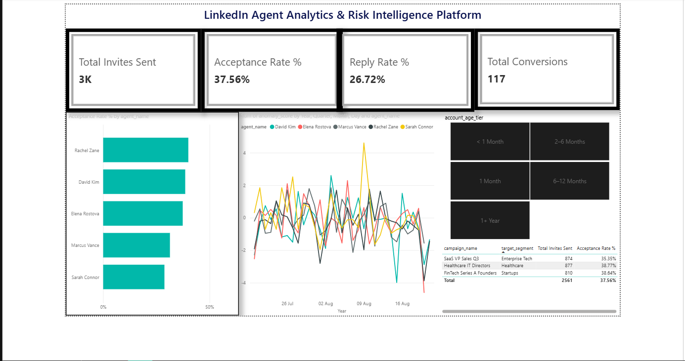

# End-to-End LinkedIn Agent Analytics Platform

[](https://github.com/shruti29075/linkedin-agent-analytics-platform/actions)
[](https://www.python.org/downloads/)
[]()
[]()

> A production-grade Data Engineering, Data Quality, and Statistical Risk Analytics platform built for automated LinkedIn outreach agents.

---

## Power BI Executive Dashboard



---

## 1. Problem Statement & Executive Summary

Automated LinkedIn outreach engines scale sales and recruiting operations. However, unmonitored outreach systems face three critical vulnerabilities:
1. **Algorithmic Shadow-Banning & Account Suspension**: Sending connection requests or messages beyond LinkedIn’s velocity thresholds leads to immediate account bans.
2. **Data Pipeline Fragility & Duplication**: Network glitches or repeated API batch jobs risk duplicating records, corrupting analytics metrics.
3. **Silent Data Quality Failures**: Malformed records or missing foreign keys corrupt reporting without raising alerts.

### The Solution
This platform delivers an enterprise-grade analytics ecosystem:
- **Part 1 SOP Adherence**: Strict binding of outreach volumes to verified LinkedIn Account Age Tiers (`<1m`, `1m`, `2-6m`, `6-12m`, `1+y`).
- **Idempotent Ingestion Pipeline**: Incremental high-watermark delta ingestion, exponential backoff retries, and dead-letter quarantine (DLQ).
- **Star Schema Data Warehouse**: ANSI SQL dimensional warehouse featuring conformed dimensions, surrogate keys, and SCD Type 2 tracking.
- **Automated 5-Dimension Data Quality Engine**: Automated validation across *Completeness, Uniqueness, Validity, Timeliness,* and *Referential Integrity* with composite scoring.
- **Statistical Anomaly & Risk Model**: Rolling EWMA and Z-score models to detect hidden risk signals (acceptance collapse, reply decay, ghosting) and dynamically throttle capacity.
- **Power BI Intelligence**: Explicit DAX measure architecture for Core KPIs, Account Health, Risk Intelligence, and Campaign ROI.
- **Observability & DevOps**: Structured JSON logs with UUID correlation IDs, Docker containerization, and GitHub Actions CI/CD.

---

## 2. Architecture & Data Flow

```
                      +---------------------------------------+
                      |   1. Polluxa Outreach API / Source    |
                      +---------------------------------------+
                                          |
                                    (Incremental)
                                          v
                      +---------------------------------------+
                      |  2. Ingestion Engine & Retries (P2)   |
                      |     - Watermark Delta Tracking        |
                      |     - Exponential Backoff & Jitter    |
                      |     - Dead Letter Queue (DLQ) Catch   |
                      +---------------------------------------+
                                          |
                                          v
                      +---------------------------------------+
                      |  3. Automated Data Quality Engine(P4) |
                      |     - 5 Core DQ Dimensions            |
                      |     - Composite Score (Threshold 95%) |
                      |     - dq_audit_log History Ledger     |
                      +---------------------------------------+
                                          |
                                          v
                      +---------------------------------------+
                      |  4. Star Schema Data Warehouse (P3)   |
                      |     - dim_agent (SCD Type 2)          |
                      |     - dim_lead, dim_campaign, dim_date|
                      |     - fact_outreach_activity          |
                      +---------------------------------------+
                                          |
                                          v
                      +---------------------------------------+
                      |  5. Statistical Risk Engine (P5)      |
                      |     - Rolling Z-Score & EWMA Decay    |
                      |     - Capacity Throttling vs SOP      |
                      |     - fact_daily_agent_metric         |
                      +---------------------------------------+
                                          |
                                          v
                      +---------------------------------------+
                      |  6. Power BI Analytics & DAX (P6)     |
                      |     - Core KPIs & Limit Utilization   |
                      |     - Risk Intelligence & Anomaly Map |
                      |     - Campaign ROI & Pipeline Value   |
                      +---------------------------------------+
```

---

## 3. Project Directory Structure

```text
linkedin-agent-analytics-platform/
├── .github/
│   └── workflows/
│       └── ci.yml                 # GitHub Actions CI/CD automated test workflow
├── config/
│   ├── config.yaml                # Pipeline, DQ weights, and statistical model settings
│   └── rate_limits.yaml           # Part 1 Account Age Tier capacity limits
├── data/
│   ├── raw/                       # Staging raw data payloads
│   ├── processed/                 # Clean transformed batches
│   ├── dead_letter/               # Quarantined malformed records (DLQ)
│   └── watermark.json             # High-watermark tracking state
├── database/
│   ├── schema.sql                 # ANSI SQL Star Schema DDL
│   ├── db_manager.py              # Schema migration & conformed date population
│   └── warehouse.db               # SQLite database
├── docs/
│   ├── architecture_diagram.md    # Detailed Mermaid system flow
│   ├── data_dictionary.md         # Column-by-column enterprise data dictionary
│   └── part1_evidence/
│       └── instructions.md        # Part 1 SOP compliance & 7-step screenshot pack
├── models/
│   └── risk_model.py              # EWMA & Z-Score anomaly detection & capacity optimization
├── pipeline/
│   ├── ingestion.py               # Secure idempotent ingestion with watermark & DLQ
│   ├── data_quality.py            # Automated 5-dimension DQ checker & composite scorer
│   └── logger.py                  # Structured JSON logger with Correlation IDs
├── powerbi/
│   ├── data_exports/              # Clean CSV exports & dashboard.pbix for Power BI
│   │   └── screenshot/            # High-res dashboard screenshots
│   ├── dax_measures.md            # Explicit DAX measure formulas & calculation library
│   └── export_data.py             # Automated table exporter
├── tests/
│   ├── conftest.py                # Isolated test database fixture
│   ├── test_pipeline.py           # Idempotency & watermark tests
│   ├── test_dq.py                 # Data Quality dimension unit tests
│   └── test_risk_model.py         # Statistical anomaly & capacity throttling tests
├── .env.example                   # Environment variable template (no hardcoded secrets)
├── .gitignore                     # Git exclusion rules
├── demo_failure_recovery.py       # Live evaluation demonstration script
├── Dockerfile                     # Multi-stage production container image
├── docker-compose.yml             # Container orchestration
├── main.py                        # Master CLI controller
├── requirements.txt               # Pinned Python dependencies
└── README.md                      # Complete project documentation
```

---

## 4. Part 1: Account Age Tier Rate Limiting Matrix

The daily invite and message ceilings are hard-coded into the pipeline configuration (`config/rate_limits.yaml`) to guarantee SOP compliance:

| Account Age Tier | Risk Classification | Daily Invites Limit | Daily Messages Limit | Cooldown Period |
| :--- | :--- | :---: | :---: | :---: |
| **< 1 Month** | Very High Risk | 5 | 10 | 48 Hours |
| **1 Month** | High Risk | 10 | 15 | 24 Hours |
| **2–6 Months** | Moderate Risk | 15 | 25 | 12 Hours |
| **6–12 Months** | Low Risk | 25 | 40 | 6 Hours |
| **1+ Year** | Minimal Risk | 30 | 60 | None |

---

## 5. Statistical Risk & Anomaly Scoring Methodology (Part 5)

### Mathematical Formulation
To detect performance anomalies without generating false alarms from weekly cyclical patterns, the model calculates a **Rolling Exponentially Weighted Moving Average (EWMA)** and **Rolling Z-Score** on daily acceptance and reply rates:

$$\mu_t = \alpha \cdot x_t + (1 - \alpha) \cdot \mu_{t-1}$$

$$Z_t = \frac{x_t - \mu_{t-1}}{\sigma_{t-1} + \epsilon}$$

Where:
- $\alpha = \frac{2}{\text{span} + 1}$ (with $\text{span} = 7 \text{ days}$).
- $\epsilon = 10^{-4}$ (prevents division by zero).

### Risk Classification & Automated Throttling
- **Normal ($Z_t > -1.5$)**: Account healthy $\to$ Recommended capacity = $100\%$ of Tier Ceiling.
- **Warning ($-2.0 \le Z_t \le -1.5$)**: Moderate decay $\to$ Capacity throttled to $70\%$ of Tier Ceiling.
- **Critical / Collapse ($Z_t < -2.0$)**: Severe collapse ($\le 2.28\%$ tail) $\to$ Capacity throttled to $30\%$ of Tier Ceiling to avoid account suspension.

---

## 6. Installation & Quick Start

### Prerequisites
- Python 3.10+
- Git
- Docker (Optional, for containerized run)

### Step 1: Clone Repository & Install Dependencies
```bash
git clone https://github.com/shruti29075/linkedin-agent-analytics-platform.git
cd linkedin-agent-analytics-platform

# Install dependencies
pip install -r requirements.txt
```

### Step 2: Initialize Database Schema
```bash
python database/db_manager.py
```

### Step 3: Run the Full Pipeline & Generate Data
```bash
python main.py --run-all
```

---

## 7. Running Automated Tests

Run the full pytest suite with coverage:
```bash
pytest -v
```

---

## 8. Live Demonstration Script (Part 8)

To demonstrate the 3 live resilience requirements (bad data quarantine, crash recovery without duplication, and end-to-end refresh):

```bash
python demo_failure_recovery.py
```

**What this verifies live**:
1. Injects corrupt records with missing foreign keys and invalid types $\to$ routes them to Dead Letter Queue (`data/dead_letter/`) while loading valid rows safely.
2. Ingests a large batch of events, notes row count, and re-executes the exact same batch $\to$ verifies **zero duplicate rows** created (Idempotency).
3. Executes warehouse export $\to$ refreshes all 8 Power BI feeds.

---

## 9. Power BI Setup & DAX Measures

1. Open **Power BI Desktop**.
2. Click **Get Data** $\to$ **Text/CSV** and select all files in `powerbi/data_exports/`.
3. In Model View, verify the Star Schema relationships (documented in `docs/data_dictionary.md`).
4. Copy and paste the explicit measures from `powerbi/dax_measures.md` into your report measure table.

---

## 10. Docker Deployment

### Build and Run with Docker Compose
```bash
docker compose up --build
```

---

## 11. Assessment Requirement Verification Matrix

| Part | Assessment Requirement | Implementation Location | Status |
| :---: | :--- | :--- | :---: |
| **Part 1** | Integration Baseline & SOP Screenshots | `docs/part1_evidence/instructions.md`, `config/rate_limits.yaml` | **Verified** |
| **Part 2** | Idempotent API Ingestion, Watermarking & DLQ | `pipeline/ingestion.py`, `pipeline/logger.py` | **Verified** |
| **Part 3** | Star Schema, SCD2, Data Dictionary & Flow | `database/schema.sql`, `database/db_manager.py`, `docs/` | **Verified** |
| **Part 4** | 5-Dimension DQ Checks, Composite Score & Audit Log | `pipeline/data_quality.py`, `dq_audit_log` table | **Verified** |
| **Part 5** | Statistical Anomaly Model, EWMA Z-Score & Throttling | `models/risk_model.py`, `fact_daily_agent_metric` | **Verified** |
| **Part 6** | Power BI DAX Measures Layer & Data Exporter | `powerbi/dax_measures.md`, `powerbi/export_data.py` | **Verified** |
| **Part 7** | Docker, GitHub Actions CI/CD & Structured JSON Logs | `Dockerfile`, `docker-compose.yml`, `.github/workflows/ci.yml` | **Verified** |
| **Part 8** | Test Suite, Recovery Demo & Documentation | `tests/`, `demo_failure_recovery.py`, `README.md` | **Verified** |
