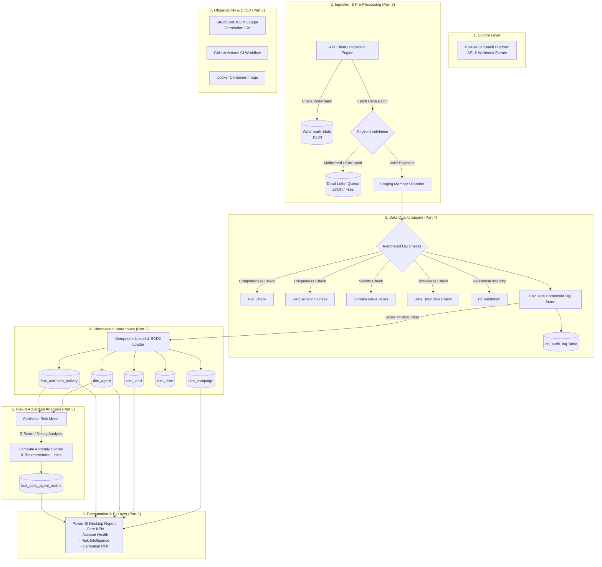

# System Architecture & End-to-End Data Flow Diagram

## 1. High-Level Pipeline Architecture

---

## 2. Data Flow Stages

### Stage 1: Extraction & Ingestion (Part 2)
- Reads high-watermark timestamp (`data/watermark.json`).
- Fetches new/updated outreach records from API or raw batch files.
- Applies exponential backoff retries with jitter on network failure.
- Quarantines malformed records into `data/dead_letter/` with detailed diagnostic tags.
- Logs pipeline run status and row counts to `pipeline_runs`.

### Stage 2: Data Quality Verification (Part 4)
- Runs 5-dimension test suite: Completeness (25%), Uniqueness (25%), Validity (20%), Referential Integrity (20%), Timeliness (10%).
- Computes weighted composite score (0-100%).
- Emits pass/fail status and logs audit history to `dq_audit_log`.

### Stage 3: Warehouse Transformation & Loading (Part 3)
- Resolves natural business keys to surrogate keys (`agent_sk`, `lead_sk`, `campaign_sk`, `date_key`).
- Manages Slowly Changing Dimensions (SCD Type 2) on `dim_agent` when status or tiers change.
- Performs idempotent merge into `fact_outreach_activity` (using `event_id` unique constraint to prevent duplicate rows).

### Stage 4: Statistical Risk & Capacity Modeling (Part 5)
- Computes 7-day rolling Exponential Weighted Moving Average (EWMA) and standard deviation of daily acceptance/reply rates.
- Generates Z-score anomaly metrics.
- Flags accounts experiencing acceptance-rate collapse or ghosting patterns.
- Calculates recommended daily invite and message capacity strictly bounded by the Account Age Tier matrix from Part 1.
- Stores daily snapshot metrics into `fact_daily_agent_metric`.

### Stage 5: BI & Visualization Layer (Part 6)
- Connects Power BI via direct relational schema or clean staged tabular feeds.
- Calculates business metrics using an explicit DAX measure layer (no implicit aggregation).
- Renders executive dashboards for Core KPIs, Account Health, Risk Intelligence, and Campaign ROI.
